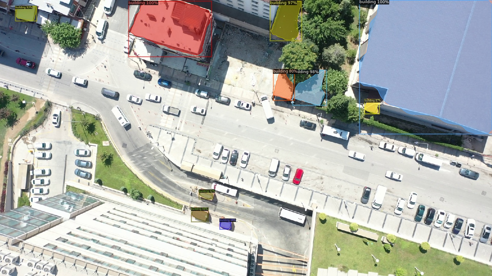
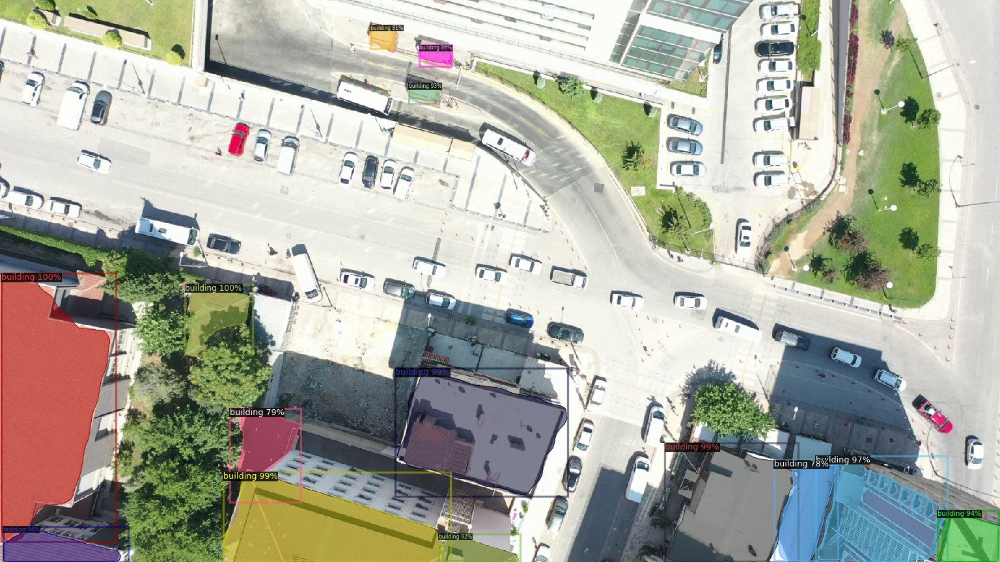

# Building Segmentation with Pytorch Detectron2

Detectron2: https://github.com/facebookresearch/detectron2

Building segmentation was performed using a dataset of 450 trains and 24 test images.
Training the model works just the same as training an object detection model. The only difference is that you will need to use an instance segmentation model instead of an object detection model. *__I used COCO Instance Segmentation with Mask R-CNN R50-C4__*

### Model Outputs:

